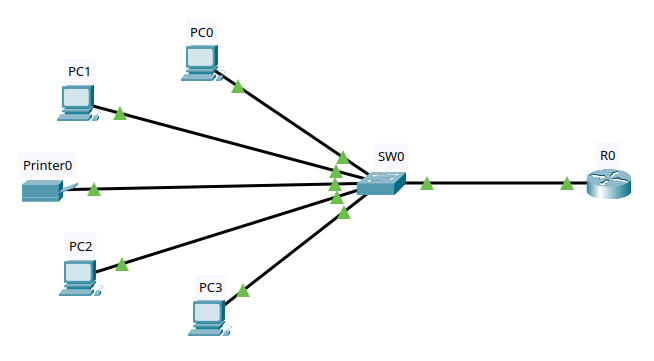

## Topology

A single switch (SW0) connects five end devices and one router (R1). R1 provides routing and DHCP for the LAN.

| Device | Connected To | Port |
|---|---|---|
| PC0 | SW0 | Fa0/1 |
| PC1 | SW0 | Fa0/2 |
| Printer0 | SW0 | Fa0/3 |
| PC2 | SW0 | Fa0/4 |
| PC3 | SW0 | Fa0/5 |
| R1 | SW0 | Fa0/6 |
| R1 (G0/0) | — | 192.168.1.1/24 |
